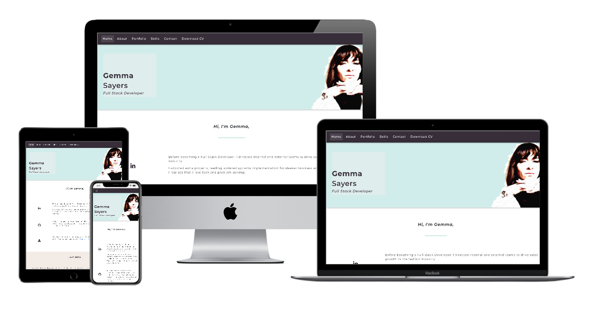

# Gemma Sayers Portfolio Project 
---

A portfolio site designed to showcase Gemma's prior employment experience as well as her recent training as a Full Stack Developer

View the live project [here](https://gjsayers.github.io/G-Sayers-Bio)

View the repository in GitHub [here](https://github.com/GJSayers/G-Sayers-Bio)

## Contents 
---

* UX
  * Project Goals & Objectives 
  * User Goals
  * Stakeholder Goals
  * User Requirements and Expectations 
  * Design choices
    * Layout & Wireframes
    * Colours
    * Icons
    * Fonts

* Technologies 
  * Languages
  * Libraries

* Features
  * Included in current deployment
  * Future implementations

* Testing 
  *  Development testing 
  *  Design edits
  *  Pre-Deployment validation testing
  *  Peer-code review & mentor feedback 
  *  Post-Deployment Results

* Bugs
  *  Development Bug & Fixes
  * Pre-Deployment Bugs & Fixes

* Deployment 
  * Method
  
* Credits

# UX #
---

### Project Goals & Objectives 
---
* To provide a portfolio site that serves to **inform** the user of the work history between Gemma's extensive experience in the fashion industry in combination with her path to becoming a Full Stack Developer for maximum future career and freelance opportunities. 

### User Goals 
---
* As a **Potential Employer for a Coding Role**, I want to;
  * Easily **find out Gemma's coding proficiency** to ascertain how this will support her role as a Full stack developer.  
  * Easily **download a CV** for comparison with other candidates. 
* As a **Potential Employer for a Leadership Role** I want to;
  * View Gemma's work and profile to **understand how Gemma's Full Stack Developer course will have given her the edge** when it comes to working in the strategy and leadership team.  
  * **reveiw Gemma's leadership experience** 
  * **download a CV**. 
* As a **Potential Collaborator**, I want to be able to;
  * **Succinctly reveiw Gemma's strengths**.
  * **contact Gemma directly through the site** 
  * **Navigate easily to Gemma's portfolio and social media pages**.  
  * **contact gemma directly through the site**.

### Stakeholder Goals 
---
* To lead the user to;
  * Contact Gemma using the **contact form** if user is a **potential employer, collaborator or client**. 
  * **Download Gemma's CV** if user is a **potential employer**. 
  * **Connect with Gemma on social media** if user is a potential employer, collaborator, or client. 

### User Reqirements and Expectations 
---
* Responsive design for accessibility across a range of devices.
* Minimal design for easy navigation.
* Easy to contact Gemma directly or through social media links.
### Design choices 
---
* Layout & Wireframes
  * I have included two sets of wireframes as initially I started to build the site intended to go across separate pages, but then decided with my mentor that a single-page site would be a much better user-experience for the purposes of this project.  Final wireframes can be seen [here](https://..assets/docs/wireframes/v2/ms1-wireframes-v2.pdf), and the originals [here](https://..assets/docs/wireframes/v2/ms1-wireframes-v1.pdf).  Filed in the wireframes folder
* Colours
  * I researched what the colour trends are for 2021 as I want my site to look current and appealing, and was inspired by some of the themes in [99designs](https://en.99designs.it/blog/trends/color-trends/). I then used [colourmind.io](http://colormind.io/) to put my colours into a pallet for consistent use on the website.  You can find my colour inspiration here. and the colour pallet below. 
  
* Icons 
  * Icons are a great way to signal to the user in a succinct way without being too wordy.  I have used icons from Font Awesome (link) across my about and skills section. 
* Imagery  
   * I have used my own photograph for the header jumbotron to ad a personal edge to the site, however for the portfolio slides, I have used stock images from Shutterstock (link) as I wanted a clean, professional look and sadly my photography is not up to much! 
* Fonts
  *  I have used the Montserrat font across the whole site and used Sans Serif and the fail-safe incase of any loading issues.  Monserrat is a simple clean font, easy to read and stylish. 

### Technologies Used
---
  * Languages;
    *  [HTML5](https://en.wikipedia.org/wiki/HTML5)
    *  [CSS3](https://en.wikipedia.org/wiki/CSS)
  * Libraries, Frameworks & Resources;
    *  [Bootstrap 4.5.3](https://getbootstrap.com/docs/4.5/getting-started/introduction/) was used 
    *  [Hover.css](https://ianlunn.github.io/Hover/) I used hover to make elements more interactive
    *  [Google Fonts](https://fonts.google.com/) I used Monserrat as the font for the whole site
    *  [Font Awesome](https://fontawesome.com/) Font awesome is where I sourced all the icons for the site
    *  [jQuery](https://jquery.com/) is used as a script to enable for example the navbar
    *  [GitHub](https://github.com/) is used to file the repository
    *  [GitHub Pages](https://pages.github.com/) was used to deploy the site
    *  [GitPod](https://gitpod.io) was used for development and version control
    *  [Balsamiq ](https://balsamiq.com) was used to create, save and export my wireframes
    *  [Colourmind](https://Colourmind.io) was used to put together my colour pallet, using the inspo images I sourced from;
    * [99designs](https://en.99designs.it/blog/trends/color-trends/) was used to research upcoming colour trends
    * [Apple Photobooth](https://apps.apple.com/us/app/photo-booth/id1208226939) was used to make my self-portrait a little more appealing!
    *  [Google Dev Tools](https://developers.google.com/web/tools/chrome-devtools) has been invaluable for solving issues and bugs and testing responsiveness. 
    *  [Techsini](https://techsini.com/multi-mockup/index.php) Was used to create the mockup images. 

### Features
---
* Included in current deployment;
  * PDF CV and a function to download.
  * Contact button to open email directly.
  * I have included interactive Hover Elements for better UX.
* Future implementations;
  * I would like to upgrade the colours as I feel these did not come across as well as I anticipated based on the pallet. 
  * I removed the form from the original design as I thought it lengthened the contact process too much - I may consider ways to add this in with UX taken into account.
  * I would look to improve the navigation bar so that it retracts on scroll.   

### Testing 
---
  *  Development testing 
    * My main development testing tool used was [Google Dev Tools](https://developers.google.com/web/tools/chrome-devtools) to continuously check responsiveness & display across different device sizes. 
  *  Design edits
  *  Pre-Deployment validation testing
  *  Peer-code review & mentor feedback 
  *  Post-Deployment Results

### Bugs
---
  * Bugs & Fixes
    * long gap on righthand side.  Took a lot of working out and help from Jim (add )
    * Navbar was not clicking and after much going around in circles a few things I discovered;
      * I did not have the js.popper installed in the right place 
      * I had a beta version of Bootstrap
      * I had nav-item and nav-link mixed up
    * Project cards were not displaying properly 
    * Skills Cards were not displaying correctly

### Deployment 
---
  * Method
  
### Credits
---
* Content
* Media
* Acknowledgements